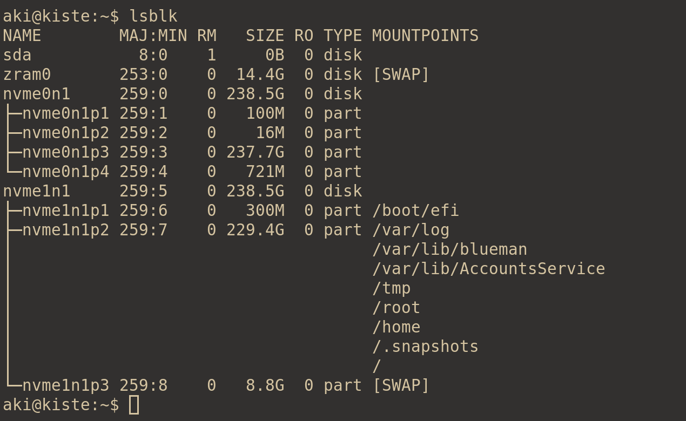
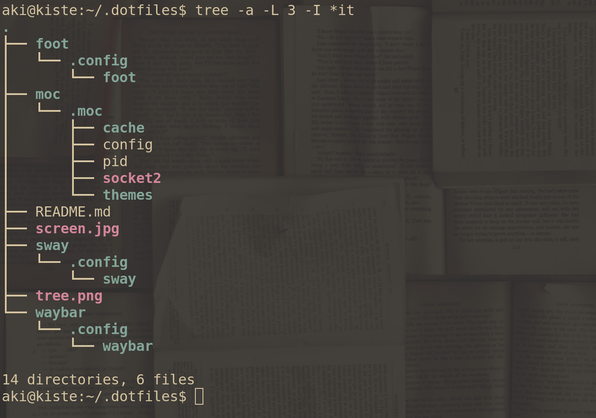

# Debian 12 Setup

This is my workbox. Hence I need reliability, security, reproducibility and interoperability.  Therefore Debian.


## Reliable, but you never know

Installed on btrfs with snapper so I can boot into a **previously working setup** if ever needed.

This what 'lsblk' looks like:




## No Spins

Completely beyond me why people use spins. Some script kiddies hack together an iso with unpredictable ingredients - implausible why one would use that.


## No Arch btw

Used it from 2001-2004 before Judd Vinet left. Constant updates, changes, crashes - the opposite of getting work done.


## NixOS

It's good. But too much work. Once flake has stabilized and matured I may look at it again.

```
{ inherit I use NixOS btw; }:
{
  Flaky flakes;
};
```


## Dotfiles

Manage them with stow. What else. You can look at them if you want to.

This what that looks like



Here is more [information](https://duckduckgo.org)


## Setup

Sway (Wayland), Waybar, Foot, VSCode, LateX, Python, R. Everything from the default repos of course. Gruvbox. Because it's good.


## Screenie


